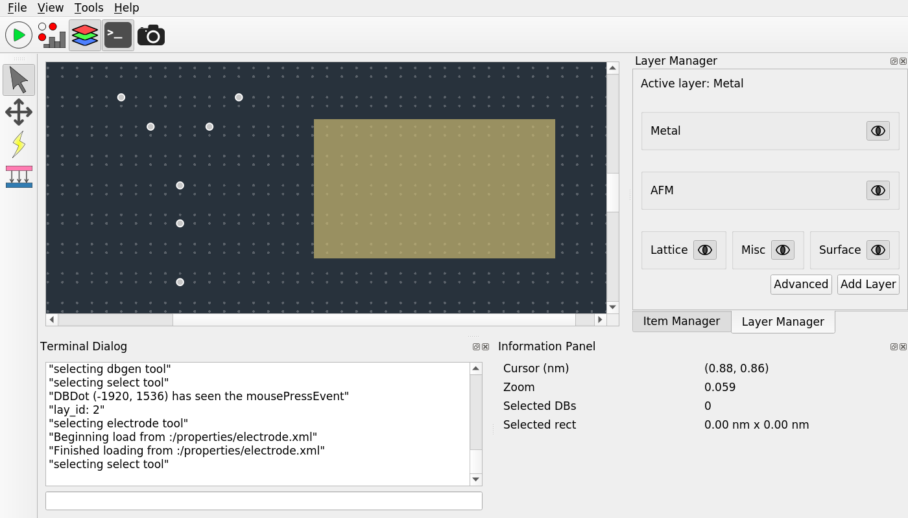
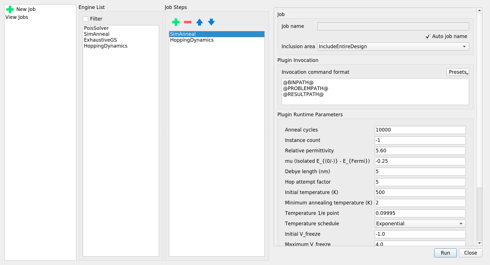

.. include:: ../macros.rst

GUI Overview
************

The SiQAD GUI consists of a few key components:

* Design panel in the center showing DBs in white, lattice sites in gray, and an electrode in gold.
* Top menu bar containing standard application toggles and features.
* Top toolbar providing access to key manager widgets, panels, and modes:

    - |jobnew|: Open the job manager dialog for creating new simulation jobs.
    - |joblogs|: View job logs in the job manager.
    - |simvis|: Toggle the simulation visualization panel for accessing simulation results.
    - |layman|: Toggle the layer manager panel which enables layer manipulation. Currently most useful for adding more Electrode layers for multi-layer electrode simulations.
    - |term|: Toggle the terminal dialog which provides real time debug output and accepts SQCommands (to be documented).

* Side toolbar detailed in later section: `Design Mode`_.
* Side and bottom docking areas for various manager widgets and panels.

Design Panel Modes and Features
===============================

Design Mode
-----------

The following design features can be found in the left toolbar:

* |select_tool| : select graphical objects in the design panel.
* |drag_tool| : drag on the design panel to pan the view point.
* |dbgen_tool| : create DBs on the design panel. Hover over the desired lattice site
* |electrode_draw_tool| : create electrodes on the design panel.

Right clicking on the design panel reveals common actions such as delete, copy, paste, and more; right clicking on electrodes further reveal options to alter their electrical properties, color, and rotation.

Screenshot Mode
---------------

|screenshot_mode| can be activated in the top toolbar or in the "Tools" menu. It changes the design panel to a high contrast screenshot theme. A pop-up window shows available options for the screenshot, where the user can define screenshot properties such as the clipping area and scale bar settings. The screenshot output is a vector graphics SVG image.

When Screenshot Mode is active, |dbgen_tool| and |electrode_draw_tool| cease to work.

The following additional design tools can be found in the side toolbar when screenshot mode is activated:

* |screenshot_area_tool| : select a region in the design panel to define the screenshot area. If no area is set, the full displayed region of the design panel is captured.
* |scale_bar_anchor_tool| : choose a position on the design panel to place the scale bar anchor. The "Show Scale Bar" option in the screenshot manager must also be enabled for the scale bar to be displayed.

Simulation Visualization Mode
-----------------------------

|sim_viz_mode| is activated automatically when simulation is complete.

When |sim_viz_mode| is active, |dbgen_tool| and |electrode_draw_tool| cease to work.

|screenshot_mode| can be activated concurrently with |sim_viz_mode| to take screenshots of simulation results.

For guidance on selecting and interpreting simulation results, please refer to the `Simulation Visualization`_ section.

Simulation Job
==============

In SiQAD, simulators are implemented as plugins. Any interaction with plugins is treated as a Job. Simulations can be invoked through the |jobman|, which is accessed through the |jobnew| button in the top toolbar.

Below is a screenshot of the |jobman| interface:

Four panes are shown:

* |jobman| Actions: set up a new job or view previous jobs.
* |englist|: Available simulation plugins, double click to add to |jslist|.
* |jslist|:

    - Chosen plugins that execute in sequence in the order shown.
    - The order of job steps can be manipulated via the buttons at the top of the pane; job steps can also be removed.

* Job and Plugin Details: 

    - The job name can be configured or be left to auto generation. Auto job names use the invocation time.
    - Inclusion area allows users to choose whether to include the entire design in the simulation or include only selected items.
    - |plug_invocation| settings allow the plugin invocation command to be altered. Each parameter must be written in a separate line. Presets are available for some engines. The following special variables are replaced at invocation:

        + ``@PYTHON@``: Python path identified by SiQAD, can be manually configured in Tools -> Settings.
        + ``@BINPATH@``: Absolute path to the plugin binary (or script file), defined in the ``*.sqplug`` or ``*.physeng`` file in the plugin's directory.
        + ``@PHYSENGPATH@``: Absolute path to the directory containing the ``*.sqplug`` or ``*.physeng`` file.
        + ``@PROBLEMPATH@``: Absolute path to the problem description file that will be exported by SiQAD for the plugin to consume.
        + ``@RESULTPATH@``: Absolute path to the result file which SiQAD expects the plugin to generate.
        + ``@JOBTMP@``: Absolute path to the temporary path allocated for the job.
        + ``@STEPTMP@``: Absolute path to the temporary path allocated for the specific job step, normally a subdirectory of ``@JOBTMP@``.

    - |plug_params| allow parameters pertaining to the plugin to be altered.

Simulation Visualization
========================

.. todo::

   TBA

Exporting and Importing Simulation Results
==========================================

After performing a simulation, you can export the results for archival and import them for future inspection. Simulation jobs may include one or multiple job steps; both cases can be handled by the exporter. Results can either be exported from the Sim Visualizer (when the job is being displayed) or from the |joblogs| page in the |jobman|. Exported results can be imported either from |joblogs| or *File -> Import Job Results*.

It is a good idea to export simulation results of novel circuit designs for archival purposes especially if you have eventual publication in mind.
