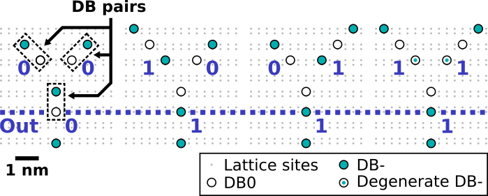
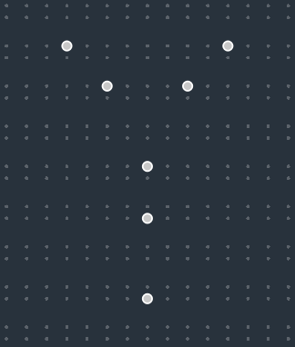
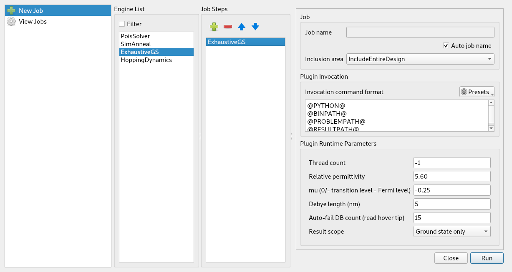
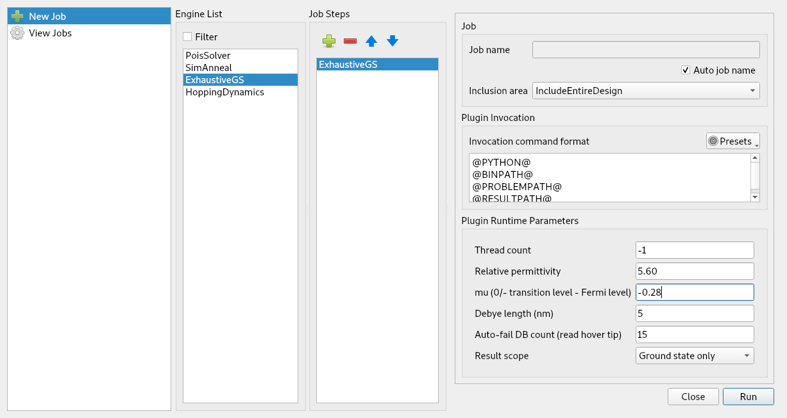

.. include:: ../macros.rst

Basic Tutorial
**************

Here, a step-by-step tutorial making use of basic SiQAD design features and ground state charge simulation tools is provided. After going through this tutorial, feel free to experiment with our `previously published design files <https://github.com/samuelngsh/published-resources/>`_ from :cite:`Ng2020_siqad`.

|ORMod| Example
===============

This is a basic tutorial which aims to walk through a simple silicon dangling bond (DB) design and simulation use case. This knowledge is sufficient to get researchers started with DB gate and circuit design. We assume that you have already acquired SiQAD on your machine; if not, please refer to the preceding document.

If you are confused at any step, please consult the documents under the Details heading on the sidebar. Failing that, feel free to reach out to the developers: siqaddev@gmail.com

In this example, we recreate |ORMod| from :cite:`Ng2020_siqad`. The expected charge configurations are:

1. Using the |dbgen_tool| on the side toolbar, draw the |ORMod|\ 00 configuration in the design panel:

2. We would like to find the ground state charge configuration for this DB layout. Click on |runsim| (hotkey: ``Ctrl+r``) in the top toolbar to access the |jobman|. Double click on ExhaustiveGS on the |englist| to add it to the |jslist|. The |jobman| should now look like this:

.. note::

    ExhaustiveGS exhaustively searches through all possible charge configurations to find the ground state charge configuration. It scales at :math:`\text{O}(N^3)` where :math:`N` is the number of DBs. Do not use it for large (~15+ DBs) problems.

3. Without altering any other settings, run the simulation. The resulting simulation result should be identical to the following figure. At the right, the |simviz| panel containing information related to the simulation also appears. When the |simviz| panel is active, |sim_viz_mode| is also active in the design panel which prevents design changes to be made.

.. note::

    Since this is a simple simulation, you should receive the result almost instantaneously on a modern machine. If this is not the case, open the |jobman| again, go to "View Jobs", and check the simulation log for the potential cause.

4. Close the |simviz| panel in order to exit |sim_viz_mode| (hotkey: ``v``). Add an input perturber to create the 10 input combination, and run the simulation again with identical settings. The resulting charge configuration disagrees with the expected configuration, we are one negative charge short:

5. Revisit the |plug_params| in the |jobman| and notice that the mu value (corresponding to :math:`\mu_-` in :cite:`Ng2020_siqad`) is :math:`-0.25` meV, whereas :cite:`Ng2020_siqad`'s |ORMod| simulations had used :math:`\mu_- = -0.28` meV. Let's change the mu value to :math:`-0.28` in |plug_params|:

6. The simulation result now aligns with the expected configuration:

From here, you can experiment with SimAnneal, a ground state charge configuration finder which implements a custom simulated annealing algorithm. The default settings generally work well for DB layouts with :math:`\lesssim 80` DBs, the :math:`\mu_-` and "Instance count" values are generally the ones that are modified. Please refer to :ref:`gs_finders_doc` for more information related to SimAnneal.

Other Common Operations
=======================

* Document saving and loading can be accessed through the "File" entry on the menu bar.
* When |select_tool| is active, common operations such as cut, copy, paste, and delete are present either through keyboard shortcuts or through the right-click menu.
* DBs can be grouped together by ``Ctrl+g`` for convenient group manipulation; they can be ungrouped by ``Ctrl+Shift+g``. Grouped DBs are called Aggregates.
